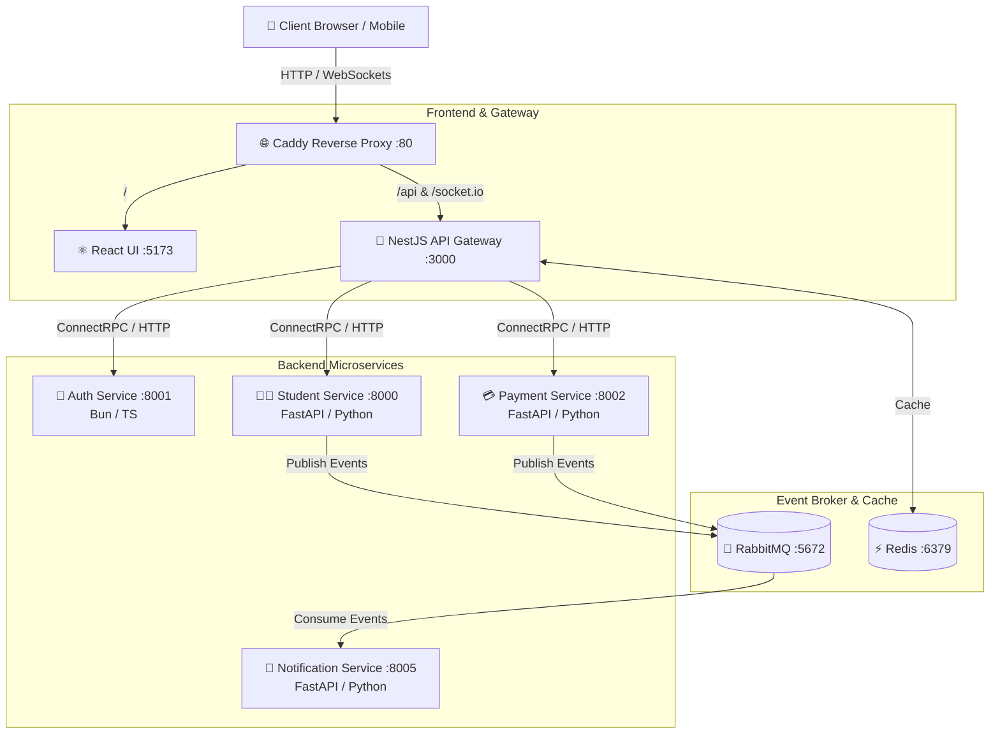

<div align="center">

# ⚙️ Microservice Architecture Platform

A high-performance, full-stack enterprise microservices application built with **NestJS API Gateway (BFF)**, **ConnectRPC/gRPC** backend services in **TypeScript** & **Python**, **RabbitMQ** event broker, **Redis** caching, and **React 18** frontend.


<p align="center">
  <a href="#-key-features">Features</a> •
  <a href="#%EF%B8%8F-architecture-overview">Architecture</a> •
  <a href="#%EF%B8%8F-tech-stack--ecosystem">Tech Stack</a> •
  <a href="#-quick-start">Quick Start</a> •
  <a href="#-services--ports-matrix">Services Matrix</a> •
  <a href="#-project-structure">Project Structure</a> •
  <a href="#%EF%B8%8F-creating-a-new-service">New Service Guide</a> •
  <a href="#-makefile-commands">Makefile</a> •
  <a href="#-testing--quality-assurance">Testing</a>
</p>

---

</div>

## ✨ Key Features

- **🚀 Backend-For-Frontend (BFF) Pattern**: NestJS API Gateway providing unified RESTful endpoints, OpenAPI/Swagger docs, and WebSocket gateways.
- **⚡ Modern Polyglot Microservices**:
  - **Auth Service**: High-speed authentication service written in TypeScript with Bun.
  - **Student & Payment Services**: Data-intensive microservices built with Python, FastAPI, and `uv`.
  - **Notification Service**: Asynchronous worker consuming RabbitMQ message queues.
- **🌐 Protocol Buffers & ConnectRPC**: Type-safe inter-service RPC communication powered by Buf code generation.
- **📩 Event-Driven Architecture**: Asynchronous messaging and background processing via RabbitMQ AMQP broker.
- **⚡ High-Performance Caching**: Centralized Redis instance for session caching, rate-limiting, and state management.
- **💻 Interactive Frontend**: Modern SPA built with React 18, Vite, TypeScript, and Tailwind CSS.
- **🛡️ Reverse Proxy & Routing**: Production-ready Caddy server routing WebSockets, REST API, and static UI traffic.
- **🧪 Comprehensive Testing Suite**: Unit tests via Bun & Pytest, E2E browser automation with Playwright, and load testing via k6.

---

## 🏗️ Architecture Overview



---

## 🛠️ Tech Stack & Ecosystem

| Layer | Technology | Description |
| :--- | :--- | :--- |
| **API Gateway** | [NestJS](https://nestjs.com/) + [Bun](https://bun.sh/) | BFF Gateway managing REST controllers, Swagger docs, & WebSockets |
| **Microservices** | [FastAPI](https://fastapi.tiangolo.com/) + [Bun](https://bun.sh/) | Polyglot services built with Python 3.11+ and TypeScript |
| **RPC Framework** | [ConnectRPC](https://connectrpc.com/) + [Buf](https://buf.build/) | High-performance, schema-driven inter-service communication |
| **Message Broker** | [RabbitMQ](https://www.rabbitmq.com/) | AMQP message broker for event-driven asynchronous messaging |
| **Cache Store** | [Redis](https://redis.io/) | In-memory key-value store for session and response caching |
| **Database** | [SQLModel](https://sqlmodel.tiangolo.com/) / [SQLite](https://sqlite.org/) | ORM and relational databases for Python services |
| **Frontend** | [React 18](https://react.dev/) + [Vite](https://vitejs.dev/) | Fast single-page application styled with Tailwind CSS |
| **Reverse Proxy** | [Caddy Server](https://caddyserver.com/) | Single entry-point HTTP reverse proxy & TLS termination |
| **Package Managers** | [Bun](https://bun.sh/) & [uv](https://github.com/astral-sh/uv) | Lightning-fast package resolution and project execution |
| **Testing** | Playwright, Pytest, Bun Test, k6 | E2E browser tests, unit/integration suites, and load testing |

---

## 🚀 Quick Start

### Prerequisites

Ensure you have the following installed on your host machine:

- **[Docker & Docker Compose](https://www.docker.com/)** (Required for containerized development)
- **[Bun](https://bun.sh/)** v1.0+ (Required for TypeScript services)
- **[uv](https://github.com/astral-sh/uv)** (Required for Python services)
- *(Optional)* **[k6](https://k6.io/)** (For running load performance tests)

### 1. Start Development Environment

Spin up all infrastructure components and microservices with hot-reload enabled:

```bash
make dev
```

### 2. Seed Initial Database Data

Populate the database tables with demo student and sample records:

```bash
make seed
```

### 3. Service Access Endpoints

Once containers are active, access the platform endpoints below:

| Application / Service | Base URL / Interface | Description |
| :--- | :--- | :--- |
| **React Web UI** | [http://localhost:5173](http://localhost:5173) | Main user interface |
| **API Gateway (REST)** | [http://localhost:3000](http://localhost:3000) | BFF API Entrypoint |
| **Swagger API Docs** | [http://localhost:3000/api](http://localhost:3000/api) | Interactive OpenAPI documentation |
| **RabbitMQ Management** | [http://localhost:15672](http://localhost:15672) | Dashboard (`user` / `password`) |
| **Student Service** | [http://localhost:8000](http://localhost:8000) | Student microservice endpoint |
| **Auth Service** | [http://localhost:8001](http://localhost:8001) | Authentication microservice |
| **Payment Service** | [http://localhost:8002](http://localhost:8002) | Payment microservice endpoint |
| **Notification Service** | [http://localhost:8005](http://localhost:8005) | Worker notification service |

---

## 🔌 Services & Ports Matrix

| Service | Language / Framework | Container Port | Host Port | Protocol |
| :--- | :--- | :---: | :---: | :---: |
| `gateway` | TypeScript / NestJS (Bun) | `3000` | `3000` | HTTP / REST / WebSockets |
| `auth` | TypeScript / Bun | `8001` | `8001` | ConnectRPC / HTTP |
| `student` | Python 3.11 / FastAPI (`uv`) | `8000` | `8000` | ConnectRPC / REST |
| `payment` | Python 3.11 / FastAPI (`uv`) | `8002` | `8002` | ConnectRPC / REST |
| `notification` | Python 3.11 / FastAPI (`uv`) | `8005` | `8005` | RabbitMQ Listener |
| `ui` | TypeScript / React 18 (Vite) | `5173` | `5173` | Web UI |
| `rabbitmq` | RabbitMQ 3 Management | `5672`, `15672` | `5672`, `15672` | AMQP / HTTP |
| `redis` | Redis Alpine | `6379` | `6379` | RESP |

---

## 📁 Project Structure

```
.
├── api/
│   ├── gateway/                 # NestJS API Gateway (BFF)
│   │   ├── src/                 # Controllers, modules, and gateway services
│   │   └── src/proto_gen/       # Auto-generated TypeScript gRPC/ConnectRPC stubs
│   ├── proto/                   # Protocol Buffer definitions (.proto files)
│   │   ├── auth.proto           # Auth service protobuf contract
│   │   ├── payment.proto        # Payment service protobuf contract
│   │   └── student.proto        # Student service protobuf contract
│   ├── scripts/                 # Automation scripts (proto-gen.sh)
│   └── services/                # Backend Microservices
│       ├── auth/                # Auth Service (TypeScript / Bun / ConnectRPC)
│       ├── notification/        # Notification Service (Python / FastAPI / RabbitMQ)
│       ├── payment/             # Payment Service (Python / FastAPI / ConnectRPC)
│       └── student/             # Student Service (Python / FastAPI / SQLModel)
├── ui/                          # Frontend Application (React 18 + Vite + Tailwind)
├── e2e/                         # End-to-End Test Suite (Playwright)
├── load-test/                   # Load & Stress Performance Tests (k6)
├── buf.yaml                     # Buf CLI configuration
├── buf.gen.yaml                 # Buf code generation template
├── Caddyfile                    # Ingress Reverse Proxy configuration
├── docker-compose.yml           # Local development orchestration
├── docker-compose.production.yml# Production deployment configuration
└── Makefile                     # Project task automation hub
```

---

## 🛠️ Creating a New Service

Follow this step-by-step workflow to add a new microservice to the system:

### 1. Define Protocol Buffer Schema
Create a new file in `api/proto/` (e.g., `api/proto/order.proto`):

```proto
syntax = "proto3";

package order.v1;

service OrderService {
  rpc CreateOrder(CreateOrderRequest) returns (CreateOrderResponse);
}

message CreateOrderRequest {
  string user_id = 1;
  double amount = 2;
}

message CreateOrderResponse {
  string order_id = 1;
  string status = 2;
}
```

### 2. Generate Stubs & Code Contracts
Execute the code generator to generate TypeScript and Python stubs:

```bash
make proto-gen
```

Generates stubs automatically in:
- `api/gateway/src/proto_gen/` (Gateway integration)
- `api/services/<service_name>/proto_gen/` (Service implementation)

### 3. Implement Service Code

- **For TypeScript/Bun**: Use `api/services/auth` as a starter blueprint.
- **For Python/FastAPI**: Use `api/services/student` or `api/services/payment` as a starter template.

### 4. Register in Orchestration & Gateway
1. Append the new service configuration to `docker-compose.yml`.
2. Add a new client module/controller inside `api/gateway/src/`.
3. Export the module inside `app.module.ts`.

---

## 💻 Makefile Commands

All common development, test, and build workflows are wrapped in the root `Makefile`:

| Command | Category | Description |
| :--- | :--- | :--- |
| `make dev` | Development | Start entire dev stack in background with hot-reloading |
| `make stop-dev` | Development | Stop and clean development containers |
| `make seed` | Database | Populate databases with initial demo data |
| `make proto-gen` | Build | Regenerate Python & TS stubs from `.proto` definitions |
| `make build-all` | Build | Build production Docker images for all services |
| `make test` | Testing | Run unit & integration test suites for all microservices |
| `make e2e-test` | Testing | Execute end-to-end browser automation tests (Playwright) |
| `make load-test-run`| Testing | Run k6 performance load test scripts |
| `make deploy` | Deployment | Deploy service stack to Docker Swarm cluster |
| `make un-deploy` | Deployment | Remove service stack from Docker Swarm cluster |
| `make clean` | Utility | Clear build artifacts and temporary files |
| `make help` | Utility | Display list of available Makefile targets |

---

## 🧪 Testing & Quality Assurance

### 1. Unit & Integration Tests

Run unit tests across all microservices with a single command:

```bash
make test
```

Or execute tests per individual service:

```bash
# Auth Service (TypeScript / Bun)
cd api/services/auth && bun test

# API Gateway (TypeScript / Bun)
cd api/gateway && bun test

# Student Service (Python / Pytest)
cd api/services/student && PYTHONPATH=. uv run pytest tests/ -v

# Payment Service (Python / Pytest)
cd api/services/payment && PYTHONPATH=. uv run pytest tests/ -v
```

### 2. End-to-End (E2E) Testing

Playwright tests validate real end-to-end user workflows (Registration, Login, Dashboard navigation):

```bash
# Ensure dev stack is running
make dev

# Run E2E tests in headless mode
make e2e-test

# Run E2E tests in interactive browser mode
cd e2e && bun playwright test --headed
```

### 3. Performance & Load Testing

Run k6 load tests to measure throughput, latency, and system stability under stress:

```bash
# Run k6 load test script
make load-test-run
```

---

## 📄 License

This project is open-source software licensed under the [MIT License](LICENSE).
